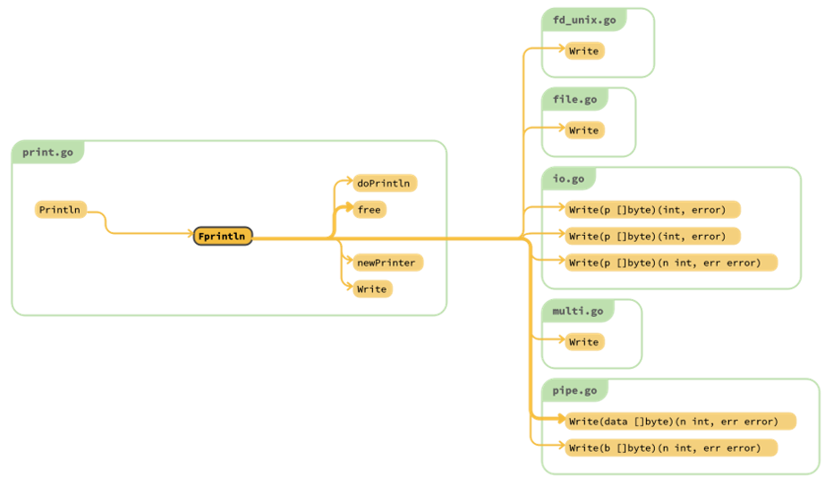

# SourcetrailGolangIndexer

Golang Indexer for Sourcetrail.

## Description

> **Updated at 2022.3.10**
> After finished runnable version of this extension at the April of 2021, I found he master branch of this project has been archived, so I cannot make a pull request. And since it had been archived, there will not be any progress on the project anymore.
> 
> If you are interested in this extension and found it lacks a CMakefiles.txt for Golang, you can just copy CMakefiles.txt from the official repository cand replace the language name by Golang, like Python => Golang. There is no big change in this part so actually it won't be a big deal.
> 
> Plus, there are more heuristic project today like goplantuml which act similar function but has standard plantuml output. Those projects may be the one you are looking for at this point.

The SourcetrailGolangIndexer is a Sourcetrail language extension supply Golang support to Sourcetrail.

Currently, this project is still in a very early state, but by using this you can already build correct Call Graph on your Golang project.

## Setup

> It could only be excuted on linux now (exactly, Debian), the whole bindings will be published very soon then you can recompile the bindings on your platform.

Just check `run.sh` or run it directly. This project absolutely depends on native tools supported by golang.org without third-party dependency.

After executing `runs.sh`, you should have this:

For usage of Sourcetrail, please check its official website.

## TOOD

- Add support for class hierachy.
